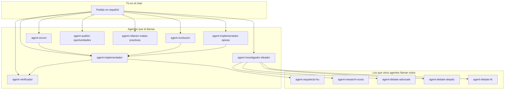

# Scrum Dev Agents

**Lleva una idea (o un producto que ya existe) hasta software implementado y verificado**, con orden Scrum y sin que el chat principal se convierta en un “hazlo todo ya”.

Plugin de agentes y skills para [Cursor](https://cursor.com). Hablas en **español**; cada agente tiene un rol claro: planificar, investigar, codear o verificar. El backlog queda documentado, el código pasa chequeos antes de darse por bueno, y las librerías que uses tienen guías escritas en tu propio proyecto — no memorias genéricas del modelo.

**Para quién:** un dev que ya usa git y Cursor, conoce historias de usuario, y quiere separar *“¿qué construimos?”* de *“vamos a codearlo”* — sin aprender un framework interno de siglas.

---

## Instalar

**Requisito:** Cursor con soporte de Plugins.

1. Abre **Cursor** → **Customize → Plugins** → **Add from GitHub**
2. Pega: `https://github.com/dguzmano96/scrum-dev-agents`
3. Abre el **workspace de tu proyecto** (no solo este repo del plugin) cuando vayas a generar skills de tu stack

Al instalar verás **8 agentes que tú invocas en el chat** y **5 que trabajan detrás** cuando hace falta. Las skills del plugin se cargan solas; las de tu stack (Next.js, .NET, Cloudflare, PostgreSQL, etc.) se crean en tu proyecto cuando eliges tecnologías.

---

## El truco (en 30 segundos)

1. **Tú pides en español** con `Usa agent-{nombre}:` y lo que necesitas.
2. **Cursor elige al especialista** — Scrum arma el plano, el Implementador construye un cuarto, Épicas levanta toda la planta, el Verificador no se cree el “ya está”.
3. **El chat principal no debería codear tu producto.** Los agentes de backlog planifican; los de implementación codean con reglas; el verificador mira con lupa.

No tienes que memorizar pipelines internos (W0–W8, I0–I9…). Esos pasos los ejecutan las skills por detrás.



---

## Receta típica

### App nueva (empiezas desde cero)

Piensa en Scrum como el arquitecto que dibuja planos y corta el trabajo en historias. Cuando el backlog está listo, el Implementador toma **una historia de usuario (HU)** a la vez; si quieres toda una épica de golpe, Épicas coordina varias HU sin saltarse pasos. Al final, el Verificador ejecuta tests y revisa que los **criterios de aceptación** (lo que debe cumplir la HU) estén cubiertos — no acepta un “listo” sin evidencia.

**Prompts para copiar:**

```
Usa agent-scrum: convierte esta idea en backlog Scrum (modo guiado completo):
[describe tu producto — usuarios, problema, restricciones]
```

```
Usa agent-implementador: implementa HU-001 del proyecto [nombre].
```

```
Usa agent-verificador: valida HU-001 — no aceptes claims sin evidencia.
```

Si la épica entera va junta:

```
Usa agent-implementador-epicas: implementa la épica EP-001 (todas las HU Must).
```

### App que ya existe (quieres agregar o cambiar algo)

Aquí entra **agent-evolucion**: mira qué hay (código y backlog), define la brecha del cambio y escribe solo lo **nuevo** — no reescribe todo el backlog desde cero. Luego el flujo es el mismo: implementar y verificar.

```
Usa agent-evolucion: evoluciona este producto — quiero agregar exportación CSV.
Hay código existente. Modo guiado.
```

Si antes de decidir necesitas comparar enfoques técnicos:

```
Usa agent-investigador-ideador: investiga la mejor forma de agregar autenticación OAuth
a este repo. Entrega reporte con opción #1 y #2. No toques código.
```

---

## Los 8 especialistas (los que tú llamas)

Invócalos con **`Usa agent-{nombre}:`** + tu pedido.

### agent-scrum

**Para qué:** convierte una idea en backlog Scrum documentado — discovery, épicas, HU bien escritas, diagramas, arquitectura y elección de stack (te pregunta; no elige solo).

**No lo uses si:** ya tienes backlog cerrado y solo quieres codear una HU concreta → ve al Implementador.

**Prueba a decir:**

```
Usa agent-scrum: convierte esta idea en backlog Scrum (modo guiado completo):
[describe tu producto]
```

**Te deja:** carpetas `00-discovery/`, `01-backlog/`, `02-arquitectura/`, `03-calidad/`, `04-sesion/` y skills de tu stack en `.cursor/skills/` del proyecto.

---

### agent-evolucion

**Para qué:** producto con código y/o backlog existente. Inventario → brecha → épicas y HU **nuevas o que reemplazan** las anteriores (backlog delta).

**No lo uses si:** es idea desde cero → usa Scrum.

**Prueba a decir:**

```
Usa agent-evolucion: evoluciona este producto — quiero agregar [feature].
Hay código existente. Modo guiado.
```

---

### agent-investigador-ideador

**Para qué:** “¿cómo hago X?”, “¿qué tecnología conviene?”. Escanea el repo, busca en documentación oficial y arma un reporte con **opción #1 recomendada y opción #2** — sin tocar código.

**No lo uses si:** ya sabes qué hacer y solo falta implementar.

**Prueba a decir:**

```
Usa agent-investigador-ideador: investiga la mejor forma de agregar [feature]
a este repo. Entrega reporte con opción #1 y #2. No toques código.
```

---

### agent-implementador

**Para qué:** implementa **una sola HU**. Antes de codear pasa un **chequeo de diseño sucio** (motores por keywords, clases gigantes, acoplamiento raro…) y escribe un briefing arquitectónico. Luego codea en trozos pequeños con evidencia de criterios de aceptación.

**No lo uses si:** quieres toda una épica de una vez → usa Implementador-Épicas.

**Prueba a decir:**

```
Usa agent-implementador: implementa HU-003 del proyecto [nombre]. Modo guiado.
```

Modo rápido solo si la HU es pequeña y sin riesgos:

```
Usa agent-implementador: implementa HU-003 en modo express
```

---

### agent-implementador-epicas

**Para qué:** coordina **toda una épica**, lanzando un Implementador por cada HU, con build y tests tras cada una. No avanza si algo queda rojo.

**No lo uses si:** es una sola HU → usa Implementador.

**Prueba a decir:**

```
Usa agent-implementador-epicas: implementa la épica EP-001 del proyecto [nombre]. Modo guiado.
```

Reanudar:

```
Usa agent-implementador-epicas: reanudar épica EP-001 desde HU-003
```

---

### agent-verificador

**Para qué:** el escéptico del equipo. Ejecuta tests, revisa cada criterio de aceptación obligatorio y vuelve a pasar el chequeo de diseño. Veredicto **PASS** o **FAIL** con huecos concretos — no edita código.

**No lo uses si:** aún no hay implementación que revisar.

**Prueba a decir:**

```
Usa agent-verificador: valida HU-003 — no aceptes claims sin evidencia.
```

Antes de release:

```
Usa agent-verificador: pre-release check — valida que EP-002 está done con evidencia.
```

---

### agent-auditor-oportunidades

**Para qué:** health check del proyecto — seguridad, tests faltantes, dependencias, calidad de código. Entrega **tarjetas de mejora** priorizadas (OPP-001, OPP-002…); **tú eliges** cuáles adoptar.

**No lo uses si:** solo quieres implementar una HU puntual.

**Prueba a decir:**

```
Usa agent-auditor-oportunidades: audita oportunidades de mejora en el proyecto [nombre].
Modo completo. Foco seguridad y tests.
```

---

### agent-refactor-malas-practicas

**Para qué:** escanea código buscando olores (lógica frágil, clases que hacen de todo, textos hardcodeados…) y genera un **plan de refactor** priorizado en Markdown. No implementa salvo que se lo pidas.

**Prueba a decir:**

```
Usa agent-refactor-malas-practicas: escanea el módulo src/api y genera plan de refactor
priorizado. Solo reporte, no implementes.
```

---

## Los que trabajan detrás

En el flujo normal **no tienes que llamarlos**. Otros agentes los invocan cuando hace falta — por ejemplo, el arquitecto escribe el briefing antes de codear, o el panel de debate cuando investigas opciones técnicas.

| Agente | Qué hace | ¿Cuándo llamarlo tú? |
|--------|----------|----------------------|
| **agent-arquitecto-hu** | Briefing vinculante por HU (patrones, límites, anti-patrones) | Solo si quieres arquitectura sin implementar |
| **agent-research-scout** | Busca libs y docs oficiales | Casi nunca; lo usa el investigador |
| **agent-debate-advocate** | Argumenta a favor de una opción | Panel del investigador-ideador |
| **agent-debate-skeptic** | Riesgos y “por qué no” | Panel del investigador-ideador |
| **agent-debate-fit** | ¿Encaja con tu stack y código actual? | Panel del investigador-ideador |

Solo arquitectura (sin código):

```
Usa agent-arquitecto-hu: genera arch-brief para HU-005 — patrones, seams y anti-patrones.
No implementes código.
```

Más prompts y diagramas: [docs/primera-linea.md](docs/primera-linea.md).

---

## Por qué no es “otro chatbot con nombres bonitos”

**Skills de tu stack, en tu repo.** Cuando eliges tecnologías, el pack **escribe skills de esas techs en tu proyecto** para que quien codea no alucine APIs. No trae guías genéricas embebidas: las genera consultando documentación oficial del día. Si se quedan viejas, puedes pedir refrescarlas.

**No inventa versiones.** Antes de nombrar una versión, API o librería, consulta fuentes oficiales y deja rastro en `sources-ledger.md` — no confía en blogs SEO ni en “creo que es la v3”.

**Backlog que se puede implementar.** Las historias siguen INVEST (independientes, acotadas, con valor). Los **criterios de aceptación** (checklist de lo que debe cumplir) van separados de los **escenarios BDD** (Given/When/Then) — no mezclados en el mismo bloque. Si algo suena vago (“rápido”, “seguro”), te pregunta umbrales concretos en lugar de inventar requisitos.

**Te pregunta en lotes, no adivina.** Usa AskQuestion: bloques de 5–12 preguntas. Sin respuestas claras no cierra épicas ni marca Must.

**Chequeo de diseño antes de codear.** El *craft gate* es un filtro binario: ¿el diseño propuesto huele mal? Sin PASS no hay plan ni “done”. Motores por keywords, clases gigantes y acoplamientos raros suelen caer aquí.

**Verificación que no se cree el “listo”.** El Verificador corre tests, revisa cada criterio obligatorio y mira el diff con ojos de quien no implementó. Sin PASS no hay done.

**Brownfield sin reescribir el mundo.** En productos existentes solo documenta el delta — épicas y HU nuevas o que reemplazan las viejas, no un backlog entero desde cero.

**Investigación con dos opciones.** Cuando hay duda técnica, el reporte trae opción #1 y #2 con argumentos — no una recomendación a ciegas.

**Tarjetas de mejora, tú decides.** La auditoría prioriza oportunidades (OPP-*) pero no convierte todo en obligatorio automáticamente.

**Estructura de proyecto predecible.** Al planificar, crea carpetas estándar para discovery, backlog, arquitectura, calidad y sesión — para que no pierdas artefactos entre chats.

---

## Qué no incluye

- **No es un runtime ni un servidor** — solo agentes y skills dentro de Cursor.
- **No trae SonarQube** — análisis estático estilo Sonar no está publicado en este repo.
- **No configura tu máquina** — no toca `AGENTS.md` global, políticas ni extensiones.
- **No commitea por ti** salvo que lo pidas explícitamente.

---

## Referencia rápida

| Si quieres… | Usa… |
|-------------|------|
| Idea → backlog completo | `agent-scrum` |
| Feature en producto existente | `agent-evolucion` |
| Investigar enfoques sin codear | `agent-investigador-ideador` |
| Implementar una HU | `agent-implementador` |
| Implementar una épica entera | `agent-implementador-epicas` |
| Confirmar que está done | `agent-verificador` |
| Health check / deuda | `agent-auditor-oportunidades` |
| Plan de refactor | `agent-refactor-malas-practicas` |
| Solo briefing arquitectónico | `agent-arquitecto-hu` |

---

## Licencia

MIT — ver [LICENSE](LICENSE). Copyright (c) 2026 Diego Guzman.
