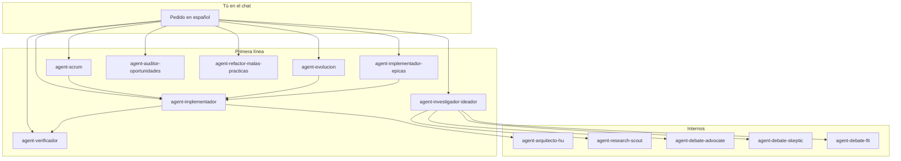

# Scrum Dev Agents

Plugin de **agentes y skills para Cursor** que te guía de una idea (o de un producto existente) hasta historias INVEST implementadas y verificadas, en **español**, con artefactos Scrum documentados y gates de calidad antes de escribir código.

**Para quién:** equipos o desarrolladores que usan Scrum en Cursor y quieren separar *discovery/backlog* de *implementación*, con verificación escéptica y skills de stack generadas en el proyecto (Next.js, .NET, Cloudflare, PostgreSQL, etc.) según lo que elijas — no memorias genéricas del modelo.

---

## Instalar

**Requisito:** [Cursor](https://cursor.com) con soporte de Plugins.

1. Abre **Cursor**
2. Ve a **Customize → Plugins**
3. Selecciona **Add from GitHub**
4. Pega la URL: `https://github.com/dguzmano96/scrum-dev-agents`

Los **13 agentes** aparecen en el selector; las **46 skills** del plugin se cargan desde `./skills/`. Para usar skills de stack en tu código, abre el **workspace del proyecto** (no solo este repo del plugin) y genera skills locales con el flujo descrito más abajo.

---

## Cómo funciona

Hay **dos capas**:

| Capa | Agentes | Rol |
|------|---------|-----|
| **Primera línea** | scrum, evolucion, investigador-ideador, implementador, implementador-epicas, verificador, auditor-oportunidades, refactor-malas-practicas | Tú hablas con ellos en el chat. Orquestan skills y subagentes. Los de backlog **no codean**. |
| **Internos** | arquitecto-hu, research-scout, debate-advocate, debate-skeptic, debate-fit | Los lanza el orquestador. Solo los invocas tú en casos puntuales (p. ej. solo briefing arquitectónico). |



**Regla práctica:** empieza siempre con `Usa agent-…` y el agente de primera línea que corresponda. No necesitas conocer los pipelines internos (W0–W8b, E0–E12, I0–I9, etc.); los skills los aplican por ti.

---

## Flujo de producto

### Greenfield (idea nueva)

1. **agent-scrum** — discovery guiado, épicas MoSCoW, HU INVEST (AC checklist + BDD Gherkin separados), arquitectura, elección de stack con AskQuestion, generación de skills `stack-*` en tu proyecto.
2. *(Opcional)* **agent-investigador-ideador** — si hay duda técnica grande antes de implementar.
3. **agent-implementador** (una HU) o **agent-implementador-epicas** (toda una épica) — craft gate + briefing arquitectónico + código en slices.
4. **agent-verificador** — tras cada HU o al cerrar épica; sin PASS no hay done.
5. *(Opcional)* **agent-auditor-oportunidades** — health check pre-release.

### Brownfield (producto existente)

1. **agent-evolucion** — inventario código + backlog, brecha del cambio, backlog **delta** (no reescribe todo).
2. *(Opcional)* **agent-investigador-ideador** — debate de enfoques para el cambio.
3. **agent-implementador** / **agent-implementador-epicas** — implementación del delta.
4. **agent-verificador** — validación escéptica con tests y AC Must.
5. *(Opcional)* **agent-refactor-malas-practicas** — si el cambio expuso deuda en el área tocada.

---

## Agentes de primera línea

En el chat, invoca con **`Usa agent-{nombre}:`** seguido de tu pedido. Ejemplos copiables en cada sección.

### agent-scrum

**Qué hace:** convierte una idea en backlog Scrum documentado: discovery → épicas → HU INVEST → diagramas Mermaid → arquitectura → stack confirmado → skills de stack en el proyecto.

**Qué NO hace:** no escribe código de producto.

**Cuándo usarlo:** producto nuevo, greenfield, “convierte esta idea en backlog”.

**Prompt de ejemplo:**

```
Usa agent-scrum: convierte esta idea en backlog Scrum (modo guiado completo):
[describe tu producto — usuarios, problema, restricciones]
```

**Qué entrega:** árbol `00-discovery/`, `01-backlog/` (épicas + HU), `02-arquitectura/` (`stack.md`, `nfr.md`, diagramas), `03-calidad/`, `04-sesion/`, skills `stack-*` en `.cursor/skills/` del proyecto tras confirmar stack.

---

### agent-evolucion

**Qué hace:** evoluciona un producto con código y/o backlog existente: inventario as-is → brecha → épicas/HU **nuevas o superseding** (delta).

**Qué NO hace:** no reescribe el backlog entero; no codea.

**Cuándo usarlo:** “agregar feature”, “modificar flujo”, “mejorar rendimiento” en brownfield.

**Prompt de ejemplo:**

```
Usa agent-evolucion: evoluciona este producto — quiero agregar exportación CSV.
Hay código existente. Modo guiado.
```

**Qué entrega:** mapas de código y backlog, `changelog-backlog`, épicas/HU delta, impacto clasificado, handoff a implementador.

---

### agent-investigador-ideador

**Qué hace:** escanea el repo, investiga con web (docs oficiales), orquesta debate entre subagentes y entrega reporte con **opción #1 recomendada + opción #2**.

**Qué NO hace:** no modifica código (readonly estricto).

**Cuándo usarlo:** “¿cómo implementar X?”, “compara enfoques”, “qué tecnología usar” antes de decidir backlog o código.

**Prompt de ejemplo:**

```
Usa agent-investigador-ideador: investiga la mejor forma de agregar autenticación OAuth
a este repo. Entrega reporte con opción #1 y #2. No toques código.
```

**Qué entrega:** reporte bajo `03-calidad/research/` con argumentación, tradeoffs, pasos de implementación sugeridos y fuentes en `sources-ledger.md`.

---

### agent-implementador

**Qué hace:** implementa **una sola HU** (pipeline I0–I9): carga contexto, craft gate, briefing arquitectónico (I3), plan, código en slices, evidencia AC/BDD.

**Qué NO hace:** no implementa una épica entera en un prompt; no commitea salvo que lo pidas.

**Cuándo usarlo:** “implementa HU-003”, una historia concreta lista en el backlog.

**Prompt de ejemplo:**

```
Usa agent-implementador: implementa HU-003 del proyecto [nombre]. Modo guiado.
```

Modo rápido (solo si la HU es pequeña y sin riesgos):

```
Usa agent-implementador: implementa HU-003 en modo express
```

**Qué entrega:** código, `04-sesion/arch-brief-HU-003.md`, evidencia de AC Must, estado en docs de sesión. Declara done solo con craft PASS + arch-brief + evidencia.

---

### agent-implementador-epicas

**Qué hace:** orquesta **toda una épica** lanzando un subagente `agent-implementador` **por cada HU**, con build+test tras cada una y docs de progreso actualizadas.

**Qué NO hace:** no escribe código él mismo; no salta HU con build rojo.

**Cuándo usarlo:** “implementa EP-001”, “todas las HU Must de la épica X”.

**Prompt de ejemplo:**

```
Usa agent-implementador-epicas: implementa la épica EP-001 del proyecto [nombre]. Modo guiado.
```

Reanudar:

```
Usa agent-implementador-epicas: reanudar épica EP-001 desde HU-003
```

**Qué entrega:** épica cerrada solo cuando todas las HU Must pasan build+test + AC con evidencia; `04-sesion/epic-EP-001-progress.md`, INDEX y trazabilidad sincronizados.

---

### agent-verificador

**Qué hace:** validador **escéptico e independiente**: ejecuta tests, comprueba AC Must, aplica craft gate; veredicto PASS o FAIL con gaps concretos.

**Qué NO hace:** no edita código; no acepta claims sin evidencia.

**Cuándo usarlo:** siempre después de implementación o antes de marcar HU/épica como done.

**Prompt de ejemplo:**

```
Usa agent-verificador: valida HU-003 — no aceptes claims sin evidencia.
```

Pre-release:

```
Usa agent-verificador: pre-release check — valida que EP-002 está done con evidencia.
```

**Qué entrega:** informe con tabla AC Must, tests ejecutados, craft gate y señal `verify-ok` | `verify-fail`.

---

### agent-auditor-oportunidades

**Qué hace:** audita salud del proyecto y prioriza fichas **OPP-*** (NFR, tests, deps/CVE, craft, skills stale). Tú eliges qué adoptar.

**Qué NO hace:** no implementa; no genera épicas/HU finales automáticamente.

**Cuándo usarlo:** health check, deuda técnica, auditoría pre-release.

**Prompt de ejemplo:**

```
Usa agent-auditor-oportunidades: audita oportunidades de mejora en el proyecto [nombre].
Modo completo. Foco seguridad y tests.
```

**Qué entrega:** informe `OPP-*` priorizado + prompts sugeridos hacia evolución, implementador o scrum.

---

### agent-refactor-malas-practicas

**Qué hace:** escanea código (repo o módulo) buscando olores de diseño (keyword engines NL, god-classes, acoplamiento, i18n hardcodeada, etc.) y genera **plan de refactor priorizado** en Markdown.

**Qué NO hace:** no implementa el refactor salvo petición explícita tuya.

**Cuándo usarlo:** antes de un refactor grande, tras detectar deuda en un módulo, revisión de craft.

**Prompt de ejemplo:**

```
Usa agent-refactor-malas-practicas: escanea el módulo src/api y genera plan de refactor
priorizado. Solo reporte, no implementes.
```

**Qué entrega:** `03-calidad/refactor/YYYY-MM-DD-refactor-malas-practicas-{scope}.md` con findings P0→P3 y pasos propuestos.

---

## Agentes internos

No necesitas invocarlos en el flujo normal; el orquestador los lanza.

| Agente | Rol | Cuándo invocarlo tú |
|--------|-----|---------------------|
| **agent-arquitecto-hu** | Escribe `04-sesion/arch-brief-{HU}.md` vinculante (patrones, seams, anti-patrones) antes de codear | Solo briefing sin implementar |
| **agent-research-scout** | Búsqueda de libs, patrones y docs oficiales | Raramente; lo usa investigador-ideador |
| **agent-debate-advocate** | Argumenta a favor de una opción candidata | Panel de debate del ideador |
| **agent-debate-skeptic** | Riesgos, costos ocultos, “por qué no” | Panel de debate del ideador |
| **agent-debate-fit** | Encaje con stack y código as-is del repo | Panel de debate del ideador |

**Solo arquitectura (sin código):**

```
Usa agent-arquitecto-hu: genera arch-brief para HU-005 — patrones, seams y anti-patrones.
No implementes código.
```

---

## Plus del pack

Más allá de “chatbots con nombres”, el plugin encadena **skills** con reglas explícitas. Esto es lo que aporta valor en la práctica.

### Skills de stack del proyecto

El plugin **no trae** skills de Next.js, .NET o Cloudflare embebidas (dependen de tu stack). En su lugar:

1. **`stack-advisor`** (fase W8 en greenfield, o al añadir tech en brownfield) propone 2–3 stacks con scores y tradeoffs. **Debes elegir con AskQuestion** — el agente no auto-elige.
2. Tras confirmar, **`stack-skill-generator`** crea skills expertas en **`{tu-proyecto}/.cursor/skills/stack-*`** (p. ej. `stack-nextjs`, `stack-dotnet`, `stack-postgresql`) consultando docs oficiales del día.
3. **`stack-skills-updater`** refresca skills stale (TTL ~30 días) o cuando pides `refresh-tech` / `/loop` periódico.

Así los implementadores **obedecen APIs y patrones verificados**, no inventan sintaxis de memoria. Abre el workspace del **proyecto** para que Cursor descubra esas skills.

### Freshness (anti-deprecación)

**`freshness-guard`** obliga WebSearch/WebFetch a docs oficiales antes de nombrar versiones, APIs o stacks. Registra claims en `02-arquitectura/sources-ledger.md`. Banlist de listicles SEO y foros como única fuente.

### Calidad de backlog

- HU **INVEST** con **`story-splitter`** si están grandes o mal acotadas.
- **AC checklist ≠ BDD Gherkin** — nunca mezclados en el mismo bloque.
- **`quality-gate`**: rúbrica 8 dimensiones; bloquea “ready” si la nota es baja.
- **`nfr-extractor`**: convierte “rápido/seguro/escalable” en umbrales medibles vía AskQuestion; no inventa Must.

### Craft + arquitectura antes de codear

- **`impl-craft-gate`**: gate binario PASS/FAIL — prohíbe motores keyword/NL, dual-track, god-class stuffing, etc. Sin PASS no hay plan ni done.
- **`agent-arquitecto-hu`** + **`impl-architecture-guide`**: briefing I3 vinculante; el implementador debe obedecerlo o pedir AskQuestion.

### Verificación escéptica

**`agent-verificador`** + **`impl-verifier`**: sin PASS no hay done. Comprueba tests, cada AC Must y craft sobre el diff.

### Brownfield sin reescritura

Inventario código + backlog (`codebase-inventory`, `backlog-as-is-mapper`), análisis de brecha y **`delta-backlog-writer`**: solo épicas/HU nuevas o superseding, no backlog desde cero.

### Investigación argumentada

**`solution-research-ideator`** + scout + panel debate (advocate / skeptic / fit) → **`solution-report-writer`**: siempre **dos opciones** con evidencia, no una sola recomendación a ciegas.

### Auditoría OPP-*

**`project-opportunity-auditor`**: NFR, gaps de tests, deps/CVE, craft, skills stale → fichas **OPP-*** priorizadas. **Tú** eliges qué adoptar en AskQuestion; no convierte todo en Must automáticamente.

### Wizard en español

Preguntas con **AskQuestion** en lotes de 5–12. **No inventa requisitos Must.** Sin completeness gate verde no hay épicas finales.

### Output scaffold

**`output-scaffold`** crea la estructura estándar del proyecto Scrum:

```text
{nombre-proyecto}/
├── .cursor/skills/          # stack-* generadas tras W8
├── 00-discovery/
├── 01-backlog/              # INDEX, traceability, EP-*/HU/
├── 02-arquitectura/         # stack, nfr, diagramas, sources-ledger
├── 03-calidad/
└── 04-sesion/               # wizard-progress, arch-brief-*, epic-*-progress
```

---

## Qué no incluye

Este plugin **no** es:

- Un **runtime** ni un servidor — solo agentes y skills para Cursor.
- **`agent-sonarqube`** — análisis estático estilo SonarQube no está publicado en este repo.
- Skills oficiales de terceros embebidas (Cloudflare Workers, Wrangler, sandbox-*, etc.) — genera las tuyas con `stack-skill-generator` en el proyecto.
- Configuración global de tu máquina (`AGENTS.md` global, políticas, extensiones).

---

## Referencia rápida

| Si quieres… | Usa… |
|-------------|------|
| Idea → backlog completo | `agent-scrum` |
| Feature en producto existente | `agent-evolucion` |
| Investigar enfoques sin codear | `agent-investigador-ideador` |
| Implementar una HU | `agent-implementador` |
| Implementar una épica entera | `agent-implementador-epicas` |
| Confirmar que está done | `agent-verificador` |
| Health check / deuda | `agent-auditor-oportunidades` |
| Plan de refactor | `agent-refactor-malas-practicas` |
| Solo briefing arquitectónico | `agent-arquitecto-hu` |

Mapa ampliado, diagramas y más prompts: [docs/primera-linea.md](docs/primera-linea.md).

---

## Licencia

MIT — ver [LICENSE](LICENSE). Copyright (c) 2026 Diego Guzman.
