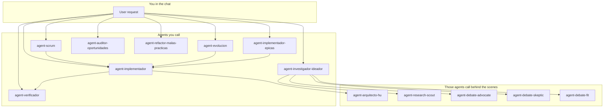

# Scrum Dev Agents

Take an idea (or an existing product) to implemented, verified software using a Scrum-aligned flow — without turning the main chat into "do everything now."

This is a plugin of agents and skills for [Cursor](https://cursor.com). Plugin instructions are English; chat, AskQuestion, and **new** artifacts use the language of the user's **first message** (skill `session-language`). Existing backlog content is left as-is unless you ask to rewrite it. Each agent has a clear role: plan, research, implement, or verify. The backlog is documented, code passes checks before marking done, and tech-specific skills are generated inside your project rather than relying on model memory.

**Who it's for:** a developer who uses git and Cursor, understands user stories, and wants to separate "what do we build?" from "let's go implement it" — without learning an internal acronym-heavy framework.

---

## Install

**Requirement:** Cursor with Plugin support.

### 1. Plugin (agents + skills)

1. Open **Cursor** → **Customize → Plugins** → **Add from GitHub**
2. Paste: `https://github.com/dguzmano96/scrum-dev-agents`
3. Open your **product** workspace (not only this plugin repo) when you generate stack skills

You should see **8 agents you call from chat** and **5 that run behind the scenes**. Plugin skills load automatically; stack-specific skills (Next.js, .NET, Cloudflare, PostgreSQL, etc.) are created inside your project when you choose technologies.

### 2. Model policy (required for nested Tasks)

Scrum decides **how** (which agent, which pipeline, one HU vs one epic). The policy decides **with what** (`model` = mode × work type). Plugin `alwaysApply` rules are **not** always injected into custom subagents, so install the policy on the machine or into the product repo.

Clone this repo first (or `cd` into an existing clone), then pick **global**, **local**, or both.

#### Global (recommended) — all Cursor windows on this PC

Run once per machine. Re-run after `git pull` if `AGENTS.md` changed.

**Windows (PowerShell)** — from the plugin repo root:

```powershell
Set-ExecutionPolicy -Scope Process Bypass
.\scripts\install-global.ps1
```

If the script is blocked:

```powershell
powershell -ExecutionPolicy Bypass -File .\scripts\install-global.ps1
```

**macOS / Linux:**

```bash
chmod +x ./scripts/install-global.sh
./scripts/install-global.sh
```

Writes:

| Path | Role |
|---|---|
| `%USERPROFILE%\.cursor\AGENTS.md` (Windows) / `~/.cursor/AGENTS.md` (macOS/Linux) | Canonical policy text |
| `%USERPROFILE%\.cursor\rules\cursor-agent-policy.mdc` / `~/.cursor/rules/cursor-agent-policy.mdc` | User rule (`alwaysApply: true`) |

#### Local — one product repo only

Use this when the team should share the mandate in git, or you do not want a machine-wide rule. Does **not** replace global; run global as well if you want every window covered.

**Windows (PowerShell)** — from the plugin repo root:

```powershell
Set-ExecutionPolicy -Scope Process Bypass
.\scripts\install-project.ps1 -ProjectPath "C:\path\to\your\product"
```

Keep the product file pointed at the machine copy:

```powershell
.\scripts\install-project.ps1 -ProjectPath "C:\path\to\your\product" -Symlink
```

**macOS / Linux:**

```bash
chmod +x ./scripts/install-project.sh
./scripts/install-project.sh /path/to/your/product
./scripts/install-project.sh /path/to/your/product --symlink
```

Writes:

| Path | Role |
|---|---|
| `{product}/AGENTS.md` | Policy text in the product repo |
| `{product}/.cursor/rules/cursor-agent-policy.mdc` | Project rule (`alwaysApply: true`) |

Optional: commit those two files so teammates get the same matrix.

### 3. New Multitask chat

1. Confirm **Customize → Rules** lists `cursor-agent-policy` (Always Apply).
2. Start a **new** Multitask chat (`/multitask`) in the product workspace.
3. The orchestrator asks **once** for mode **low / mid / high / cursor** (in the language of your first message).
4. Every `Task` must set `model` from the matrix. Scrum does not pick slugs. Details: [docs/orquestacion.md](docs/orquestacion.md), [`AGENTS.md`](AGENTS.md).

---

## The trick (in 30 seconds)

1. You request in your language using `Usa agent-{name}:` (examples below). Session language = first chat message.
2. The chat asks the model mode (**low / mid / high / cursor**) once per Multitask session.
3. Scrum picks the specialist and the pipeline. The **model policy** maps `modo activo` × work type to a slug on **every** `Task` (including nested). Never omit `model`.
4. The main chat should not implement your product. Backlog agents plan; implementer agents write code under rules; the verifier inspects thoroughly.



---

## How the model policy acts

Two layers. Do not mix them.

| Layer | Question | Who |
|---|---|---|
| **How** | Which agent, which phase, one HU vs one epic? | Scrum (`agent-*`, pipelines W / I / Epi) |
| **With what** | Which model slug? | `matrix[mode][type]` — skill `cursor-agent-policy` |
| **In which language** | Chat and new artifacts? | First message — skill `session-language` |

Every `Task` (child and grandchild) must include `model`, `modo activo: low|mid|high|cursor`, and `session language: {tag}`. Nesting is **not** a cheaper row: an architect grandchild uses the **`decide`** row, not the parent's `implement` slug.

| You call | Matrix type | Example slug in **low** |
|---|---|---|
| `agent-scrum` / `agent-evolucion` / `agent-implementador-epicas` | `plan` | `composer-2.5` |
| `agent-implementador` | `implement` | `gemini-3.7-flash-high` |
| `agent-arquitecto-hu` (nested) | `decide` | `gemini-3.8-flash-high` |
| `agent-verificador` | `verify` | `claude-4.5-haiku-thinking` |
| `agent-investigador-ideador` | `research` | `gpt-5.4-mini-medium` |

If you do not pick a mode, the orchestrator stays on **low** and says so. Naming a model or "use Fast" wins **on that** `Task` only.

---

## Sample chat

**You** (first message — this sets Spanish for the session):

```
Usa agent-scrum: convierte esta idea en backlog Scrum (modo guiado completo):
una app para apuntar bloqueos del daily. Interno, 20 personas, sin login el primer mes.
```

**Scrum Dev:** asks mode once (policy). Until you answer it operates in **low**.

**You:** `mid`

**Scrum Dev:** launches `agent-scrum` with `model` = `matrix[mid][plan]`, `modo activo: mid`, `session language: es`. Discovery questions in Spanish. No product code.

Later, same chat (mode and language are **not** re-asked):

```
Usa agent-implementador: implementa HU-001. Modo guiado.
```

Lookup: `implement` × `mid`. Before code it launches `agent-arquitecto-hu` with a **new** lookup (`decide` × `mid`) and waits for `arch-ok`. You approve the plan; then slices; then:

```
Usa agent-verificador: valida HU-001 — no aceptes claims sin evidencia.
```

Lookup: `verify` × `mid`. Narrative in Spanish; tokens stay `PASS` / `FAIL` / `verify-ok`.

Same pipeline if the first message is English — only the user-facing text changes. IDs (`HU-001`), folders (`01-backlog/`), and Gherkin (`Given` / `When` / `Then`) are never localized.

---

## Typical recipe

### New app (starting from zero)

Think of Scrum as the architect who draws blueprints and slices work into stories. When the backlog is ready, the Implementer takes **one user story (HU)** at a time; if you want an entire epic at once, Epics coordinates multiple HUs without skipping steps. At the end, the Verifier runs tests and checks that the **acceptance criteria** are met — it will not mark done without evidence.

**Copy-paste prompts (Spanish and English both route; session language follows your first message):**

```
Usa agent-scrum: convierte esta idea en backlog Scrum (modo guiado completo):
[describe tu producto — usuarios, problema, restricciones]

Use agent-scrum: convert this idea into a Scrum backlog (full guided mode):
[describe your product — users, problem, constraints]
```

```
Usa agent-implementador: implementa HU-001 del proyecto [nombre].
Use agent-implementador: implement HU-001 for project [name].
```

```
Usa agent-verificador: valida HU-001 — no aceptes claims sin evidencia.
Use agent-verificador: validate HU-001 — do not accept claims without evidence.
```

If the epic must go as a single job:

```
Usa agent-implementador-epicas: implementa la épica EP-001 (todas las HU Must).
Use agent-implementador-epicas: implement epic EP-001 (all Must HUs).
```

### Existing app (you want to add or change something)

Use **agent-evolucion**: it inventories what exists, defines the change gap, and writes only the **new** backlog items — it does not rewrite the whole backlog. Then the flow is the same: implement and verify.

```
Usa agent-evolucion: evoluciona este producto — quiero agregar exportación CSV.
Hay código existente. Modo guiado.

Use agent-evolucion: evolve this product — I want to add CSV export.
Code exists. Guided mode.
```

If you need to compare technical approaches before deciding:

```
Usa agent-investigador-ideador: investiga la mejor forma de agregar autenticación OAuth
a este repo. Entrega reporte con opción #1 y #2. No toques código.

Use agent-investigador-ideador: research the best way to add OAuth authentication
to this repo. Deliver a report with option #1 and #2. Do not modify code.
```

---

## The 8 specialists (those you call)

Invoke them with **`Usa agent-{name}:`** + your request.

### agent-scrum

**Purpose:** convert an idea into a documented Scrum backlog — discovery, epics, well-written user stories (acceptance criteria + separate Given/When/Then scenarios), diagrams, architecture, and stack selection (the agent asks; it does not choose on its own).

**Produces:** folders `00-discovery/`, `01-backlog/`, `02-arquitectura/`, `03-calidad/`, `04-sesion/` and tech skills in `.cursor/skills/` inside your project.

---

### agent-evolucion

**Purpose:** product with existing code/backlog. Inventory → gap → epics and HUs **new or replacing** old ones (backlog delta).

**Try saying:**

```
Usa agent-evolucion: evoluciona este producto — quiero agregar [feature].
Hay código existente. Modo guiado.

Use agent-evolucion: evolve this product — I want to add [feature].
Code exists. Guided mode.
```

---

### agent-investigador-ideador

**Purpose:** "how do I do X?", "which tech fits best?". Scans the repo, searches official docs, and delivers a report with **option #1 recommended and option #2** — does not touch code.

**Try saying:**

```
Usa agent-investigador-ideador: investiga la mejor forma de agregar [feature]
a este repo. Entrega reporte con opción #1 y #2. No toques código.

Use agent-investigador-ideador: research the best way to add [feature]
to this repo. Deliver a report with option #1 and #2. Do not modify code.
```

---

### agent-implementador

**Purpose:** implements **a single user story (HU)**. Before coding it runs a dirty-design check (keyword engines, giant classes, odd coupling...) and writes an architectural briefing. Then it codes in small slices with evidence for acceptance criteria.

**Try saying:**

```
Usa agent-implementador: implementa HU-003 del proyecto [nombre]. Modo guiado.
Use agent-implementador: implement HU-003 for project [name]. Guided mode.
```

Quick mode only for small, low-risk HUs:

```
Usa agent-implementador: implementa HU-003 en modo express
Use agent-implementador: implement HU-003 in express mode
```

---

### agent-implementador-epicas

**Purpose:** coordinate an entire epic, launching an Implementer per HU, with build and tests after each one. It stops on failures.

**Try saying:**

```
Usa agent-implementador-epicas: implementa la épica EP-001 del proyecto [nombre]. Modo guiado.
Use agent-implementador-epicas: implement epic EP-001 for project [name]. Guided mode.
```

Resume:

```
Usa agent-implementador-epicas: reanudar épica EP-001 desde HU-003
Use agent-implementador-epicas: resume epic EP-001 from HU-003
```

---

### agent-verificador

**Purpose:** the team's skeptic. Runs tests, checks each mandatory acceptance criterion, and re-runs the design check. Verdict **PASS** or **FAIL** with concrete gaps — does not edit code.

**Try saying:**

```
Usa agent-verificador: valida HU-003 — no aceptes claims sin evidencia.
Use agent-verificador: validate HU-003 — do not accept claims without evidence.
```

Before release:

```
Usa agent-verificador: pre-release check — valida que EP-002 está done con evidencia.
Use agent-verificador: pre-release check — validate that EP-002 is done with evidence.
```

---

### agent-auditor-oportunidades

**Purpose:** project health check — security, missing tests, dependencies, code quality. Delivers prioritized improvement cards (OPP-001, OPP-002...); you choose which to adopt.

**Try saying:**

```
Usa agent-auditor-oportunidades: audita oportunidades de mejora en el proyecto [nombre].
Modo completo. Foco seguridad y tests.

Use agent-auditor-oportunidades: audit improvement opportunities in project [name].
Full mode. Focus security and tests.
```

---

### agent-refactor-malas-practicas

**Purpose:** scans code for smells (fragile logic, classes doing everything, hardcoded texts...) and produces a prioritized refactor plan in Markdown. It does not implement unless explicitly requested.

**Try saying:**

```
Usa agent-refactor-malas-practicas: escanea el módulo src/api y genera plan de refactor
priorizado. Solo reporte, no implementes.

Use agent-refactor-malas-practicas: scan module src/api and generate a prioritized
refactor plan. Report only, do not implement.
```

---

## Agents that run behind the scenes

In normal flow you don't call them. Other agents invoke them when needed — for example, the architect writes the briefing before coding, or the debate panel when researching options.

| Agent | What it does | When to call directly |
|--------|----------|----------------------|
| **agent-arquitecto-hu** | Briefing tied to a HU (patterns, seams, anti-patterns) | Only if you want an architecture brief without implementation |
| **agent-research-scout** | Finds libs and official docs | Mostly used by the investigator |
| **agent-debate-advocate** | Argues in favor of a candidate option | Investigator's panel |
| **agent-debate-skeptic** | Risks and "why not" | Investigator's panel |
| **agent-debate-fit** | Fit with your stack and existing code | Investigator's panel |

More prompts and diagrams: [docs/primera-linea.md](docs/primera-linea.md).

---

## Why this is not "another chatbot with pretty names"

**Stack skills inside your repo.** When you choose technologies, the pack writes skills for those techs in your project so implementers don't have to guess APIs. It does not embed generic vendor guides; it generates them using official docs. If they get stale you can ask to refresh them.

**It does not invent versions.** Before naming a version, API, or library, it consults official sources and records them in `sources-ledger.md` — it does not rely on blog memory.

**Backlog that can be implemented.** Stories follow INVEST. Acceptance criteria (what the HU must meet) are separate from BDD scenarios. Vague terms ("fast", "secure") trigger follow-up questions for measurable thresholds.

**AskQuestion in batches.** Use AskQuestion for 5-12 questions. Without clear answers the agents do not close epics or mark Must.

**Design gate before code.** The craft gate is a binary filter: does the proposed design smell? Without PASS there is no plan. Common triggers: keyword engines, giant classes, odd coupling.

**Verification that does not accept "done".** The Verifier runs tests, checks each mandatory acceptance criterion, and inspects diffs with a neutral reviewer mindset. Without PASS there is no done.

**Brownfield without rewriting the world.** In existing products it documents the delta — epics and HUs that are new or replace old ones, not a full backlog rewrite.

**Research with two options.** When there is uncertainty, the report delivers option #1 and option #2 with arguments — not a blind recommendation.

**Improvement cards, you decide.** The audit prioritizes opportunities (OPP-*) but does not auto-make them mandatory.

**Predictable project layout.** Planning creates standard folders for discovery, backlog, architecture, quality and session so artifacts don't get lost between chats.

---

## What it does not include

- **Not a runtime or server** — only agents, skills and the model policy inside Cursor.
- **No SonarQube** — Sonar-style static analysis is not in this repo.
- **It does include the model policy** — `AGENTS.md` + skill `cursor-agent-policy`. Install it globally and/or locally (commands above).
- **Does not commit on your behalf** unless you explicitly ask it to.

---

## Quick reference

| If you want... | Use... |
|-------------|------|
| Idea → complete backlog | `agent-scrum` |
| Feature in existing product | `agent-evolucion` |
| Research approaches without coding | `agent-investigador-ideador` |
| Implement one HU | `agent-implementador` |
| Implement an entire epic | `agent-implementador-epicas` |
| Confirm something is truly done | `agent-verificador` |
| Health check / technical debt | `agent-auditor-oportunidades` |
| Refactor plan | `agent-refactor-malas-practicas` |
| Only an architecture brief | `agent-arquitecto-hu` |
| How models are chosen | [`AGENTS.md`](AGENTS.md) · [docs/orquestacion.md](docs/orquestacion.md) |

---

## License

MIT — see [LICENSE](LICENSE). Copyright (c) 2026 Diego Guzman.
