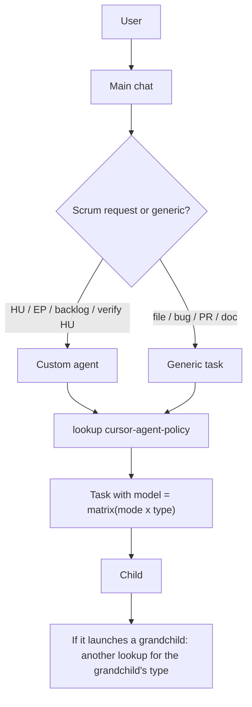

# How Scrum and the model policy coexist

One plugin, two layers. Not two separate products.

| Layer | Artifacts | Question |
|---|---|---|
| **How** | `agents/`, process skills (W0–W8, I0–I9, Epi, R, O) | Which pipeline, which gate, HU/epic ceiling |
| **What (which models)** | `AGENTS.md`, `rules/cursor-agent-policy.mdc`, skill `cursor-agent-policy`, `docs/matriz.md` | Mode, type, slug |
| **In which language** | Skill `session-language` | Chat and new artifacts (first message) |

The main chat asks for the mode **once** (`low` / `mid` / `high` / `cursor`) and forwards that selection to every `Task` as `modo activo: …` (active mode). The session language (the language of the user's first message) is also forwarded on every `Task` so subagents know which language to use. Any subagent launcher **must** set `model` using the skill lookup; omitting `model` bypasses the policy for that branch.



Operational details: see [`AGENTS.md`](../AGENTS.md) and [`skills/cursor-agent-policy/SKILL.md`](../skills/cursor-agent-policy/SKILL.md).

## Machine mandate (global)

The plugin's `alwaysApply` rules do not always enter every agent's runtime context. After installing the plugin, run **once per PC** from the plugin repo root (re-run after `git pull` if `AGENTS.md` changed):

**Windows (PowerShell):**

```powershell
Set-ExecutionPolicy -Scope Process Bypass
.\scripts\install-global.ps1
```

**macOS / Linux:**

```bash
chmod +x ./scripts/install-global.sh
./scripts/install-global.sh
```

That copies `AGENTS.md` to `%USERPROFILE%\.cursor\AGENTS.md` (or `~/.cursor/AGENTS.md`) and writes `…/.cursor/rules/cursor-agent-policy.mdc`.

## Project overlay (local)

Optional. One product repo only. Does not replace global.

**Windows (PowerShell):**

```powershell
.\scripts\install-project.ps1 -ProjectPath "C:\path\to\your\product"
```

**macOS / Linux:**

```bash
./scripts/install-project.sh /path/to/your/product
```

Writes `{product}/AGENTS.md` and `{product}/.cursor/rules/cursor-agent-policy.mdc`. You may commit those files so the team shares the same matrix.
