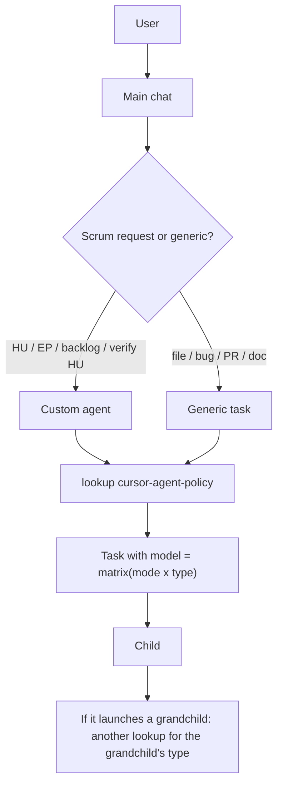

# How Scrum and the model policy coexist

One plugin, two layers. Not two separate products.

| Layer | Artifacts | Question |
|---|---|---|
| **How** | `agents/`, process skills (W0–W8, I0–I9, Epi, R, O) | Which pipeline, which gate, HU/epic ceiling |
| **What (which models)** | `AGENTS.md`, `rules/cursor-agent-policy.mdc`, skill `cursor-agent-policy`, `docs/matriz.md` | Mode, type, slug |
| **In which language** | Skill `session-language` | Chat and new artifacts (first message) |

The main chat asks for the mode **once** (`low` / `mid` / `high` / `cursor`) and forwards that selection to every `Task` as `modo activo: …` (active mode). The session language (the language of the user's first message) is also forwarded on every `Task` so subagents know which language to use. Any subagent launcher **must** set `model` using the skill lookup; omitting `model` bypasses the policy for that branch.


```mermaid
flowchart TB
  U[User] --> O[Main chat]
  O --> M{Scrum request or generic?}
  M -->|HU / EP / backlog / verify HU| S[Custom agent]
  M -->|file / bug / PR / doc| G[Generic task]
  S --> T[lookup cursor-agent-policy]
  G --> T
  T --> X["Task with model = matrix(mode x type)"]
  X --> N[Child]
  N --> T2[If it launches a grandchild: another lookup for the grandchild's type]
```

Operational details: see [`AGENTS.md`](../AGENTS.md) and [`skills/cursor-agent-policy/SKILL.md`](../skills/cursor-agent-policy/SKILL.md).

## Plugin mandate

Adding this repo under **Customize → Plugins** loads agents, skills, and `rules/cursor-agent-policy.mdc` (`alwaysApply: true`). Declare that path in `.cursor-plugin/plugin.json` so Cursor scans `rules/` once.

`sessionStart` runs `hooks/session-start.ps1` on Windows (PowerShell, already installed) and `hooks/session-start.sh` on macOS and Linux (`sh`, already installed). When `today` is after `vence`, or `precios_consultados` is more than one calendar month old, it injects `additional_context` telling the orchestrator to run the price refresh before any slug. A fresh table injects nothing. Cloud agents do not run `sessionStart` at true session start; the same dates inside the Always Apply rule still apply there.

A weekly GitHub Action (`.github/workflows/price-freshness.yml`) opens one issue when that window has passed. Merging the refresh to `main` is what ships new prices with the next plugin update. The action does not rewrite the matrix.

If an older install copied the rule to `~/.cursor/rules/cursor-agent-policy.mdc`, remove that copy so Customize → Rules lists the plugin rule once.

## Project overlay (local)

Optional. One product repo only, when that repo should commit its own copy. The plugin rule and a project rule together list two Always Apply entries.

**Windows (PowerShell):**

```powershell
.\scripts\install-project.ps1 -ProjectPath "C:\path\to\your\product"
```

**macOS / Linux:**

```bash
./scripts/install-project.sh /path/to/your/product
```

Writes `{product}/AGENTS.md` and `{product}/.cursor/rules/cursor-agent-policy.mdc`. You may commit those files so the team shares the same matrix.
