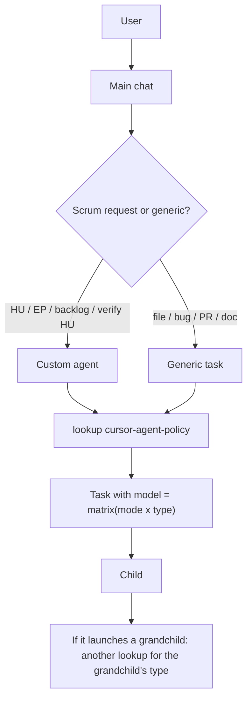

# How Scrum and the model policy coexist

One plugin, two layers. Not two separate products.

| Layer | Artifacts | Question |
|---|---|---|
| **How** | `agents/`, process skills (W0–W8, I0–I9, Epi, R, O) | Which pipeline, which gate, HU/epic ceiling |
| **What (which models)** | `AGENTS.md`, `rules/cursor-agent-policy.mdc`, skill `cursor-agent-policy`, `docs/matriz.md` | Mode, type, slug |
| **In which language** | Skill `session-language` | Chat and new artifacts (first message) |

The main chat asks for the mode **once** (`budget` / `low` / `mid` / `high` / `cursor` / `emergencia`) and forwards that selection to every `Task` as `modo activo: …` (active mode). In **emergencia**, subagent prompts carry more context (same Task ceilings). The session language (the language of the user's first message) is also forwarded on every `Task` so subagents know which language to use. Any subagent launcher **must** set `model` using the skill lookup; omitting `model` bypasses the policy for that branch.


```mermaid
flowchart TB
  U[User] --> O[Main chat]
  O --> M{Scrum request or generic?}
  M -->|HU / EP / backlog / verify HU| S[Custom agent]
  M -->|file / bug / PR / doc| G[Generic task]
  S --> T[lookup cursor-agent-policy]
  G --> T
  T --> X["Task with model = matrix(mode x type)"]
  X --> N[Child]
  N --> T2[If it launches a grandchild: another lookup for the grandchild's type]
```

Operational details: see [`AGENTS.md`](../AGENTS.md) and [`skills/cursor-agent-policy/SKILL.md`](../skills/cursor-agent-policy/SKILL.md).

## Plugin mandate

Adding this repo under **Customize → Plugins → Add → From GitHub** (not Import Marketplace) loads agents, skills, hooks, and `rules/cursor-agent-policy.mdc` (`alwaysApply: true`). `.cursor-plugin/plugin.json` sets `"rules": "./rules/"`. Plugin rules live with the plugin under **Customize → Plugins → scrum-dev-agents**. **Customize → Rules** is the user-rule list (`+ New`) and can stay empty after install.

`sessionStart` runs `hooks/session-start.ps1` on Windows (PowerShell, already installed) and `hooks/session-start.sh` on macOS and Linux (`sh`, already installed). When the active table is stale (`today` is after `vence`, or `precios_consultados` is more than one calendar month old), it injects `additional_context` telling the orchestrator to inform the user in the session language and ask whether they want to update models on their machine. A fresh table injects nothing.

When the user agrees to a local refresh (not now): launch one subagent per model, in parallel, each using the cheapest Task-catalog slug that can WebSearch/WebFetch (not one subagent for all models). After they return, the same cheap slug applies the existing math in `docs/fuentes.md` and writes only to `~/.cursor/scrum-dev-agents/` (Windows: `%USERPROFILE%\.cursor\scrum-dev-agents\`). GitHub stays the baseline. No GitHub Action. If the user declines, the current table continues in force without refreshing.

If an older install copied the rule to `~/.cursor/rules/cursor-agent-policy.mdc`, remove that user-rule copy so only the plugin rule applies. You do not need `install-global` when the plugin is installed.

## Project overlay (local)

Optional. One product repo only, when that repo should commit its own copy. The plugin rule and a project rule together list two Always Apply entries.

**Windows (PowerShell):**

```powershell
.\scripts\install-project.ps1 -ProjectPath "C:\path\to\your\product"
```

**macOS / Linux:**

```bash
./scripts/install-project.sh /path/to/your/product
```

Writes `{product}/AGENTS.md` and `{product}/.cursor/rules/cursor-agent-policy.mdc`. You may commit those files so the team shares the same matrix.
