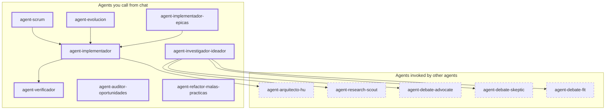

# First-line agents

These are the agents you call directly from the Cursor chat. Each orchestrates skills and other agents behind the scenes; in normal use you don't need to call the behind-the-scenes agents directly.

> Primary guide: the [README](../README.md) explains installation, common recipes (new app vs existing app), the 8 specialists with copy-paste prompts, and why this pack is not "another chatbot."
>
> Model selection: see [docs/orquestacion.md](orquestacion.md) and [`AGENTS.md`](../AGENTS.md). Scrum defines the "how"; the policy maps mode+type to a model slug on each `Task`.

## Agent map

Solid lines = agents you call. Dashed lines = agents the orchestrator calls for you.

---

## First line (what to use)

| Agent | When to use it | What it does |
|-------|---------------|--------------|
| **agent-scrum** | New idea / greenfield product | Guided discovery → epics → well-formed HUs (acceptance criteria + separate Given/When/Then) → architecture → stack selection. Does not implement. |
| **agent-evolucion** | Existing product | Inventory → gap analysis → backlog delta (only new or replacing epics/HUs). Does not implement. |
| **agent-investigador-ideador** | "How to implement X?", compare approaches | Scans the repo, researches web, runs debate panels, delivers a report (recommended option #1 + option #2). Read-only. |
| **agent-implementador** | A single HU | Design check → architectural brief → plan → code in small slices → evidence of acceptance criteria. |
| **agent-implementador-epicas** | A whole epic | Coordinates one HU after another via subagents; build + test after each HU. |
| **agent-verificador** | After implementation or before marking done | Skeptical reviewer: runs tests, checks mandatory criteria, re-runs design check. PASS/FAIL with evidence. Read-only. |
| **agent-auditor-oportunidades** | Health check, pre-release, debt | Audits NFRs, missing tests, dependencies, quality → prioritized improvement cards. Does not implement. |
| **agent-refactor-malas-practicas** | Design smells, refactor plan | Generates a prioritized refactor plan under `03-calidad/refactor/`. Does not implement unless requested. |

---

## Agents invoked by other agents (brief)

| Agent | Role |
|-------|------|
| **agent-arquitecto-hu** | Writes `arch-brief-{HU}.md` (patterns, seams, anti-patterns) before code. You may request a briefing only. |
| **agent-research-scout** | Finds libraries, patterns, and official docs (launched by the investigator). |
| **agent-debate-advocate** | Argues in favor of a candidate option. |
| **agent-debate-skeptic** | Lists risks, hidden costs, and why an option may fail. |
| **agent-debate-fit** | Evaluates fit with your codebase and stack. |

---

## If you want... use...

| Goal | Agent |
|------|-------|
| Convert an idea into a full Scrum backlog | `agent-scrum` |
| Add or change features in an existing product | `agent-evolucion` |
| Research technical approaches without coding | `agent-investigador-ideador` |
| Implement a single user story | `agent-implementador` |
| Implement all HUs of an epic | `agent-implementador-epicas` |
| Confirm that something is actually done | `agent-verificador` |
| Audit project health before release | `agent-auditor-oportunidades` |
| Generate a refactor / anti-pattern plan | `agent-refactor-malas-practicas` |
| Request an architecture brief only | `agent-arquitecto-hu` |

---

## Example prompts

Use the copy-paste prompts in the [README](../README.md). English and Spanish examples both work; the session language is the language of the user's first message (skill `session-language`).

## Notes

- Session language: first chat message. Do not default to Spanish.
- Implementer agents **do not commit** unless you explicitly ask.
- Stack skills (Next.js, .NET, etc.) are generated in your project when you choose technologies.
