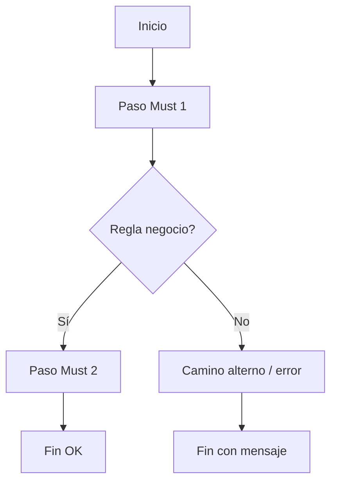

# EP-{NN}-{slug}/flujo.mmd — ejemplo de esqueleto

```mermaid
flowchart TD
  A[Inicio] --> B[Paso Must 1]
  B --> C{Regla negocio?}
  C -->|Sí| D[Paso Must 2]
  C -->|No| E[Camino alterno / error]
  D --> F[Fin OK]
  E --> G[Fin con mensaje]
```

Reemplazar nodos con pasos reales de las HU Must. Idioma: Español.
