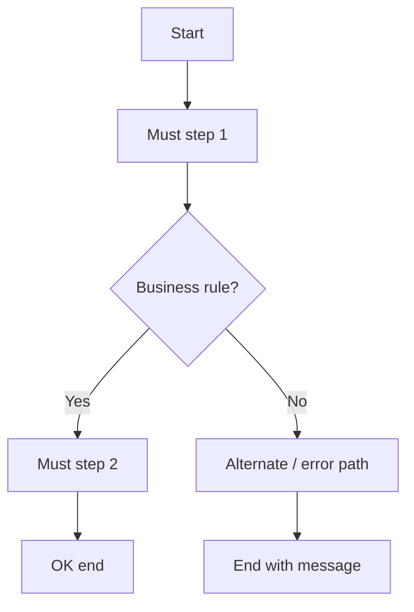

# EP-{NN}-{slug}/flujo.mmd — ejemplo de esqueleto

Replace nodes with the real Must steps from the HUs. Use the session language for diagram labels (follow the `session-language` skill).

```mermaid
flowchart TD
  A[Start] --> B[Must step 1]
  B --> C{Business rule?}
  C -->|Yes| D[Must step 2]
  C -->|No| E[Alternate / error path]
  D --> F[OK end]
  E --> G[End with message]
```
